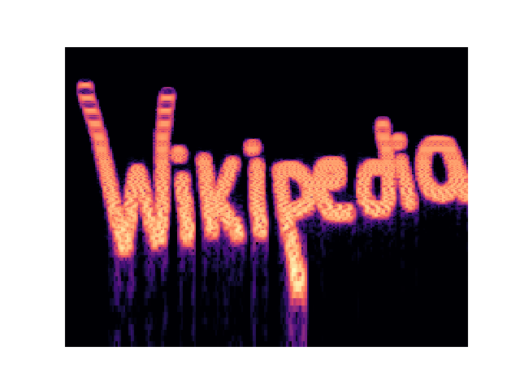

# StegoScan

## Overview

StegoScan.py is a powerful, next-generation tool for automated steganography detection in websites, web servers, and local directories, integrating AI-driven object and text recognition with deep file analysis. Unlike traditional steganography detection tools that focus on a limited set of file types or require manual processing, StegoScan.py is designed for comprehensive, automated scanning—scraping websites, dissecting embedded files, and detecting hidden messages across a broad range of formats, including PNG, JPG, BIN, PDF, DOCX, WAV, and MP3.

One of its groundbreaking innovations is the integration of AI models such as YOLO and TrOCR for object and text detection within images and audio files. Traditional OCR (Optical Character Recognition) tools are notoriously unreliable, often failing to recognize even basic text hidden in images due to noise, distortions, or non-standard fonts. StegoScan.py overcomes this by offering optional AI-enhanced text detection, dramatically improving the ability to extract hidden messages from images, scanned documents, and even spectrograms of audio files. This is a game-changer for forensic analysts, cybersecurity professionals, and law enforcement agencies who need high-confidence text extraction from compromised media.

Another novel feature is deep file extraction—a critical advancement in steganalysis. StegoScan.py doesn't just scan the surface of PDFs and DOCX files; it goes further, extracting and analyzing embedded files within them. This means steganographic content hidden inside attachments or deeply nested documents can be uncovered, addressing a major blind spot in traditional scanning tools.

The tool also boasts website and web server scanning capabilities, making it invaluable for security researchers monitoring illicit data exchanges or law enforcement tracking cybercriminals. A single command can analyze entire domains or IP ranges, retrieving and inspecting suspicious media and documents for hidden communications. Whether it’s detecting covert exchanges in dark web marketplaces, identifying embedded propaganda in misinformation campaigns, or revealing concealed instructions within terrorist networks, StegoScan.py offers unparalleled visibility into steganographic threats.

By combining multiple steganalysis techniques into a unified test suite, StegoScan.py provides a detailed and multi-layered analysis of files, offering security teams, digital forensics experts, and cybersecurity researchers a cutting-edge solution to an evolving digital threat. As steganography techniques become more sophisticated, traditional tools fall short—StegoScan.py ensures organizations stay ahead of bad actors by detecting what others miss. For a more detailed description of steganography and how it's used review the section titled "Background and Rational of StegoScan".

## How StegoScan Works

StegoScan first creates its own Python enviorment by creating a local enviroment folder. It then installs all required tools and packages that are required to run the tool suite. Once everything is installed it will verify the (if selected) IP address(s) to ensure they are webservers. Then using the IP address(s) and or website URL's supplied it will scrape all available files of the listed filetypes given in the command arguments. If a local directory is also selected it will copy these files as well. All the collected files will be stored in the choosen directory and sorted by file type. Once this is complete StegoScan will create a results directory and begin executing all of the test slected. As files containing steganographic techniques are found they are stored in the results folder under the folder associated with the test that identified the steganography. Once all test are complete the tool will end the execution.

## Novel Features

* Website and Web Server Scanning Abilities – Unlike conventional steganalysis tools that focus only on static files, StegoScan.py actively scans entire websites, IP ranges, and web servers for hidden messages. Whether investigating dark web marketplaces, cybercriminal forums, or compromised corporate sites, it automates the entire process, retrieving and analyzing files for embedded steganographic content. No more manual downloading and sorting—StegoScan does it all for you!

* AI Object and Text Detection on Images and Audio Files – Traditional OCR (Optical Character Recognition) is unreliable, often failing on distorted text, non-standard fonts, or noisy images. StegoScan.py integrates advanced AI models like YOLO and TrOCR to enhance text extraction and object detection, revealing hidden messages that standard OCR completely misses. Even audio spectrograms can be scanned for steganographic content, offering unparalleled insight into hidden data exchanges!

* Deep File Extraction in PDFs and DOCX Files – Most tools barely scratch the surface when analyzing document files, but StegoScan.py digs deeper! It automatically extracts embedded files hidden within PDFs, DOCX documents, and other complex formats, analyzing them for steganographic data. This eliminates a major blind spot—hidden payloads concealed inside innocent-looking documents are no longer safe from detection. No more overlooked hidden files—if it's there, StegoScan will find it.

* Combined Tool Test Suite for Detailed File Analysis – StegoScan.py isn't just a one-trick pony. It combines multiple steganography detection methods into a single, powerful test suite, ensuring layered, thorough analysis of every scanned file. Rather than relying on a single detection technique (which can be easily evaded), StegoScan cross-checks files using multiple methods to maximize detection accuracy. Why settle for one scanning method when you can have them all in a seamless workflow?

* Automated and Optimized for Linux – Tired of wrestling with dependencies? StegoScan.py is plug-and-play! It automatically installs what it needs, ensuring a smooth, efficient scanning process without manual setup. Built for speed and efficiency, it runs seamlessly on Linux, making it the perfect tool for cybersecurity professionals, penetration testers, and forensic analysts.

## General Features

* Web Scraping & File Downloading – Automates the extraction and downloading of specific file types from URLs, IP addresses, and IP ranges, enabling large-scale web content analysis.

* Local Directory Extraction & Testing – Scans local directories for steganographic content, identifying hidden messages within stored files.

* Image Processing & Steganography Analysis – Performs in-depth steganographic testing on images, using multiple detection techniques to uncover hidden data.

* Embedded File Extraction from PDFs & DOCX – Extracts and analyzes images and embedded files from PDF and DOCX documents, a critical step in identifying deeply hidden steganographic content.

* Steganographic Detection Tools – Integrates stegano, stegdetect, and zsteg for multi-layered detection of concealed messages within image files.

* AI-Powered Object & Text Detection – Enhances traditional detection methods with AI-driven analysis:

* YOLOv8 for high-accuracy object detection, identifying embedded images, and symbols.

* TrOCR for advanced text recognition, extracting text from handwritten, stylized, or distorted fonts with improved accuracy over standard OCR tools.

* Basic Malware & ELF File Analysis – Performs preliminary security analysis on ELF binaries and other executables, helping to identify potential malware threats.

* Audio & Binary File Analysis – Analyzes WAV and MP3 files for hidden steganographic data, including messages embedded in spectrograms or inaudible frequency ranges.

* Binary File Structure Extraction – Utilizes Binwalk to extract and inspect hidden files, firmware, and embedded data within binary files.

* Multi-Threading Support – Optimized for performance, enabling fast and efficient scanning of large datasets, making it ideal for forensic investigations and large-scale cybersecurity applications.

# Steganography Test Suite

1. LSB - Uses stegano Python import to check PNG files for plain text messages hidden in the LSB of the file.

  
  

2. Image integrity - Uses Pillow Python import to check PNG and JPG file's integrity.

3. Hist - Uses Matplotlib Python import to generate histograms showing the distribution of RGB color values for PNG and JPG files.

4. Object detection - Uses YOLOv8 and TrORC to test each layer of PNG and JPG files by removing the LSB iterativly and testing only red, green, and blue filters on the image.

  
  

5. Jpeg - Uses Stegdetect Linux commandline tool to test JPG files to detect hidden data embedded within images using techniques like jSteg, jphide, Outguess, F5 (header analysis), invisible secrets, appendX and camouflage.

6. Png - Uses Zsteg Linux commandline tool to test PNG to detect LSB steganography, check different color channels (R, G, B, A) and their bit planes, detects common encoding techniques used to hide data in images, payload extraction, text and ASCII hidden messages, and entropy analysis.

  
  

7. Audio integrity - Uses Wave Python import to check MP3 and WAV file's integrity.

8. Audio dectection - Uses Librosa Python import to generate audio spectrogram's for MP3 and WAV files that are then ran through YOLOv8 and TrORC to check for images or messages hidden in the depiction of the frequency values for the file over the time length of the file.

  
  

9. Binary - Uses Binwalk Linux commandline tool to test binary files for embedded files & data, identifies known file signatures inside a binary (e.g., ZIP, PNG, ELF, etc.), detects firmware components within a binary image, compressed and encrypted data, finds compressed data (e.g., LZMA, GZIP, BZIP2) inside files, flags encrypted or obfuscated data, file system signatures, recognizes embedded file systems (e.g., SquashFS, JFFS2, EXT, FAT), detects compiled executables (ELF, PE, Mach-O), identifies bootloaders and firmware components, and entropy analysis

10. Elf check - Uses YARA rules, magic bytes, Linux file command, and entropy analysis to check all files for embeded malware.

## Basic Usage

sudo python StegoScan.py -u "https://example.com" -t "*" -o "downloads" -m "all"

# Arguments:

-u, --url : Base URL(s), IP address(es), or IP range(s) to scrape files from.

-t, --types : Comma-separated list of file extensions to download (* for all files).

-n, --num : Number of files to download.

-o, --output : Output directory.

-m, --mode : Test mode to specify specific tests (e.g., lsb,hist) or "all" for all tests.

-l, --local : Path to a local file or directory for analysis.

# Example Commands

## Download files from a URL
sudo python StegoScan.py -u "https://example.com" -t "jpg,png" -n 5 -o "downloads" -m "all"

## Analyze a local directory
sudo python StegoScan.py -l "path/to/local/files" -t "*" -o "downloads" -m "lsb,hist,png"

# Notes

All scraped files will be stored in the output directory supplied in the execution.

Automatically creates and installs new enviroment for all nessasary Python imports.

The script installs poppler-utils, stegdetect, binwalk, and zsteg automatically.

GPU acceleration is used if a CUDA-compatible GPU is detected.

# Future Enhancements - Anticipated completion date: May 2025

Create GUI implentation if no commandline arguments are supplied. 

Expand test suite to include Strings, Exiftool, StegSeek, WavSteg, OpenPuff, and Stegcracker.

Expand to a web crawler and allow for diffrent search depths. 

Expand malware analysis with more YARA rules.

Improve object detection using advanced image processing techniques.

Expand to Google Drive scanning.

# Background and Rational of StegoScan

Steganography being the practice of hiding messages within other non-suspicious data—has seen a notable increase in utilization within criminal activities. Advancements in digital technologies have enabled malicious actors to embed illicit information within seemingly innocuous files such as images, audio, or video. For example, there have been reports suggesting that terrorist organizations have used steganography to conceal instructions within digital photographs posted on the internet. Additionally, the rise of Voice over Internet Protocol (VoIP) communications has led to the development of techniques that hide data within voice streams, making detection even more challenging. 

In the realm of public media, steganography has also made its presence felt. Beyond its malicious uses, it has been employed for legitimate purposes such as digital watermarking, where copyright information is covertly embedded into media files to protect intellectual property rights. This technique allows content creators to trace the distribution of their work and combat unauthorized usage. Furthermore, the concept of social steganography has emerged, where individuals hide messages within cultural references, idioms, or pop culture content shared publicly, making the underlying messages visible only to certain audiences.

Given the increasing use of steganography in cybercrime, terrorism, and covert communications, it is crucial to develop tools that can scan websites for these hidden messages. Criminals and malicious actors exploit digital steganography to secretly exchange data, such as stolen credentials, malware commands, or illicit instructions, all while avoiding detection by traditional cybersecurity measures. Without the ability to scan and analyze web content for embedded messages, law enforcement and security agencies may struggle to track illegal activities, leading to potential threats to national security, financial systems, and personal privacy. Additionally, with the rise of misinformation and covert influence campaigns, steganographic techniques could be leveraged to spread hidden propaganda or coordinate disinformation efforts. Implementing scanning mechanisms would help identify and mitigate these risks while balancing privacy concerns, ensuring that steganography is not misused for nefarious purposes.

# License

This project is open-source and available under the MIT License.

